# Lab 1

## Content of Lab 1

[1. Confluent Cloud overview](lab1.md#1-confluent-cloud-overview)

[2. Creating a Confluent Cloud Kafka Cluster](lab1.md#2-creating-a-confluent-cloud-kafka-cluster)

[3. Creating a Kafka topic](lab1.md#3-creating-a-kafka-topic)

[4. Generating dummy data with Kafka Connect DataGen Source Connector](lab1.md#4-generating-dummy-data-with-kafka-connect-datagen-source-connector)

[5. Enforcing Data Governance through schemas](lab1.md#5-enforcing-data-governance-through-schemas)

[6. Getting starting with stream processing](lab1.md#6-getting-starting-with-stream-processing)

[7. Data pipeline observability through Stream lineage](lab1.md#7-data-pipeline-observability-through-stream-lineage)

[8. Conclusion]()
## 1. Confluent Cloud overview
Login to [Confluent Cloud](https://confluent.cloud) with the username and password communicated to you prior to the workshop.


Confluent Cloud is organized around the following structure:
* [Organization](https://docs.confluent.io/cloud/current/access-management/hierarchy/organizations/cloud-organization.html): An organization is a root node in Conflient Cloud.
Usually an organisation represents a company or a subsidiary (one user can be attached to multiple orgs but the billing is made per organisation).

* [Environment](https://docs.confluent.io/cloud/current/access-management/hierarchy/cloud-environments.html): An environment host the technical components like Kafka Clusters, Flink Compute pools or a Schema Registry.
You can define multiple environments in an organization.
Usually an environement represents a departement or a a project stage (production vs dev).


Confluent Cloud implements [predefined RBAC roles](https://docs.confluent.io/cloud/current/access-management/access-control/rbac/predefined-rbac-roles.html) in order to restrict the access to certain resources.

> **_QUESTION:_**  Can you guess which role you currently have?

## 2. Creating a Confluent Cloud Kafka Cluster

Time to create your very first Kafka Cluster!
For the scope of the workshop, everything will be done using the Confluent UI.
Of course, everything can be done via the [Command Line]((https://docs.confluent.io/confluent-cli/current/install.html) ) (aka. CLI), via [API](https://docs.confluent.io/cloud/current/api.html) or using [Confluent's Terraform provider](https://registry.terraform.io/providers/confluentinc/confluentcloud/latest/docs)

The following steps will guide you through the creation process, if you want a more complete guide, we highly suggest t have a look to [Manage Kafka Clusters on Confluent Cloud
](https://docs.confluent.io/cloud/current/clusters/create-cluster.html)

Let's start from your environement and click on `Create Cluster on my own`.


Confluent Cloud proposes different types of Kafka Cluster.
Each of them have it's own characteristics macthing different requirements


> **_QUESTION:_**  According to the [Cluster limit comparison](https://docs.confluent.io/cloud/current/clusters/cluster-types.html), can you guess which cluster type Michelin is using?

For the workshop scope, you'll be creating a `Basic` cluster.

Confluent Cloud is available on the [3 main Cloud Providers](https://docs.confluent.io/cloud/current/clusters/regions.html):
* Amazon Web Services (aka. AWS)
* Microsoft Azure
* Google Cloud Platform (aka. GCP)

When you create a cluster in Confluent Cloud, you must specify and cloud provider and region for that cluster.
Cloud Provider costs are locality-dependant as such, the price of the cluster might be different depending of the provider/region.

For the workshop scope, you'll be creating your `Basic` cluster on AWS on `eu-west-1`


Time for the most difficult part of the workshop, find a name for your cluster :) 
We suggest to name it `cluster_<username>`.

You can review your cluster configuration and associated limits before creating it.

Cluster pricing id defined as:
```
Cluster cost = Confluent Kafka Unit (aka. CKU == compute)/hour + storage/hour + ingress + egress
```
As you cann the actual price of a cluster depends on its usage.
More details on pricing can be found [here](https://www.confluent.io/confluent-cloud/pricing/).


Your cluster is now created! Let's drill into it.


The cluster dashboard gives us information about the usage of the cluster.

On the righ hand side, you can add metdata to this cluster like a description or tags.
[Confluent Cloud permits to tags](https://docs.confluent.io/cloud/current/stream-governance/stream-catalog.html#tag-entities-data-and-schemas) all the resources (environments, clusters, topics, connectors, etc.) permitting to search elements by multiple dimensions.

You can also see that the cluster as an ID in the form `lkc-123456`.
`lkc-` stands for logical Kafka cluster
This ID is the one to provide to support when you face an issue with your cluster.
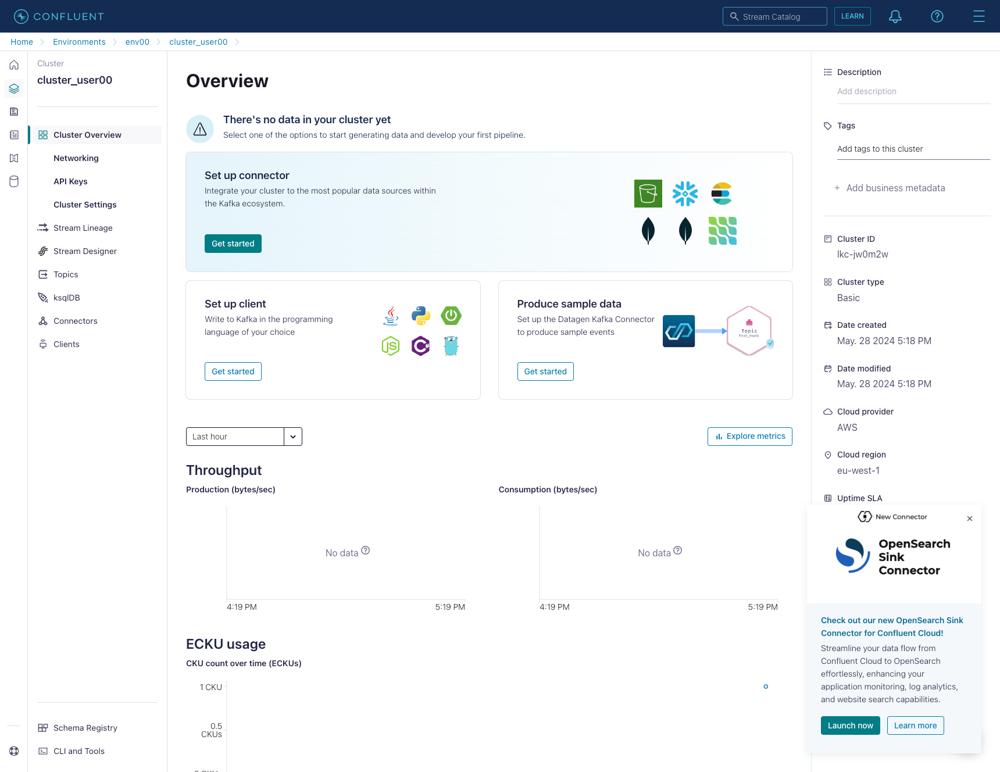

Finally let's check the cluster settings.
The bootstrap server url is the connection chain clients will use to connect to your Kafka cluster.

> **_QUESTION:_**  if `lkc` stands for *logical* Kafka cluster, can you guess what `pkc` stands for?


## 3. Creating a Kafka topic

Now that you have a cluster, let's create a topic!
A [Kafka topic](https://developer.confluent.io/courses/apache-kafka/topics/) is a virtual data structure representing a log of events. 

Logs are easy to understand, because they are simple data structures with well-known semantics. First, they are append only: When you write a new message into a log, it always goes on the end. Second, they can only be read by seeking an arbitrary offset in the log, then by scanning sequential log entries. Third, events in the log are immutable—once something has happened, it is exceedingly difficult to make it un-happen. 

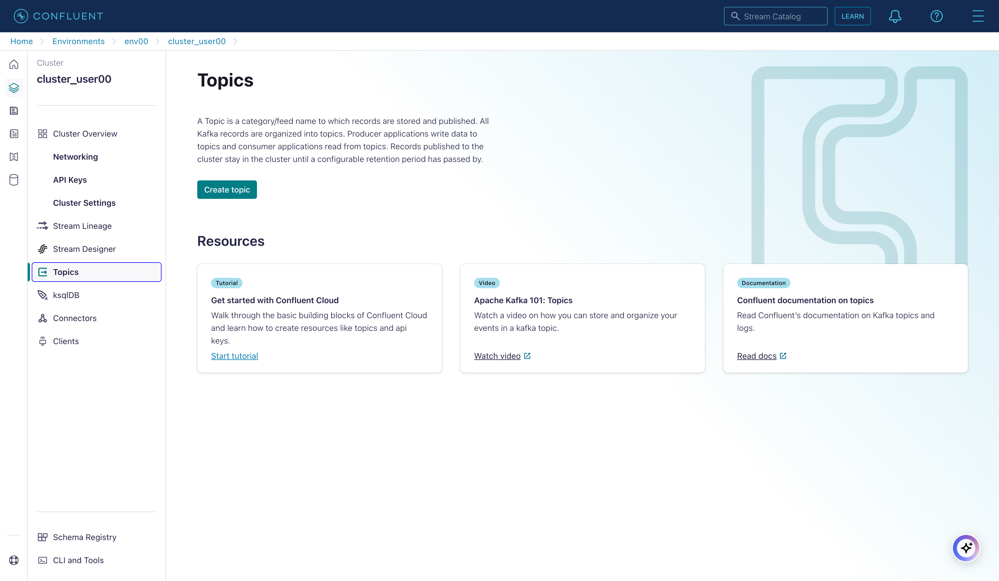

So our first topic will be named `shoe_orders` and will store... shoe orders...

Topics are made of partitions. Partitions are the unit of scalability of Kafka. Rather than storing all the topic's data in one single machine, the information will be bucketed and spread on multiple machines (called brokers) permitting to produce/consume in parallel and horizontally scale the cluster based on our needs.

It is up to the Kafka producer to determine to which partition a message will be sent to:
* If the message has no key, then messages will be sent round-robin to guarantee an even distribution of the data.
* If the message has a key, then the destination partition will be computed from a hash of the key. This guarantees that all the messages with the same key will be sent to the same partition. 

Because production/consumption can be made in parallel, Kafka can only guarantee ordering per partition, in other words per key.

Message ordering is a common constraint. This creates the possibility that a very active key will create a larger and more active partition.

Defining the number of partition for topic is one of most complex Kafka question. People tend to overestimate the number of partition (100, 256, etc.) which might create other issues.

A good starting point is Jun Rao (one of the 3 Kafka creators and Confluent co-founder) blog post: [How to Choose the Number of Topics/Partitions in a Kafka Cluster?](https://www.confluent.io/blog/how-choose-number-topics-partitions-kafka-cluster) 

When creating the topic, expand the `Show advanced settings`

> **_QUESTION:_**  Using the [Kafka Topic Configuration reference](https://docs.confluent.io/platform/current/installation/configuration/topic-configs.html) can you guess what are the roles of the properties `replication.factor` and `min.insync.replicas`.

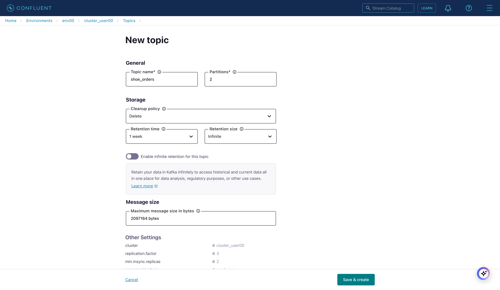

*You can skip the Data Contract UI for now*

Once the topic created you can got to the Topics UI and check your recently created topic details


## 4. Generating dummy data with Kafka Connect DataGen Source Connector

So far we creates a cluster and topic but we don't have data yet flowing... Time to fix this.
For the scope of the workshop, we'll simulate some incoming data. In order to do this, you will be using Kafka Connect DataGen Source Connector.

Apache Kafka is a pipe, a great one but still a dumb pipe. We need to put data in it. We could use a Kafka Producer to produce data but quite often the data is already present in a 3rd party tool like a database, a queue or even a file. On the other side we could be developing a Kafka Consumer to read data but very likely the data will have to be offload from Kafka to another database, datalake or queue, etc. 
In order to ease the integration's job, Kafka comes with a component called Kafka Connect to... connect Kafka to the rest of the world.
Sepcific Connectors (ie. plugins) are then deployed on top of Kafka Connect to read or write data from/to 3rd party solutions.

We'll find 2 categories of connectors:
* Source Connector: Reading data from a system and writing into Kafka
* Sink Connector: Reading from Kafka adn writing into a system

Confluent provides 120+ self-managed connectors and 70+ fully managed connectors.
You can find the exhaustive list of connectors on [Confluent Hub](https://www.confluent.io/hub/) repository

> **_QUESTION:_**  How many Azure related connectors exists? How many of them are supported by Confluent? How many can be run as fully managed?

Because demoing Kafka is a common concern, Confluent created a connector that generates dummy data: [Datagen source Connector](https://www.confluent.io/hub/confluentinc/kafka-connect-datagen).

We'll be using this plugin to create some data. Let's go.
In the Connectors UI, you have access to all the fully managed connectors.
Click on the Datagen Source connector tile.

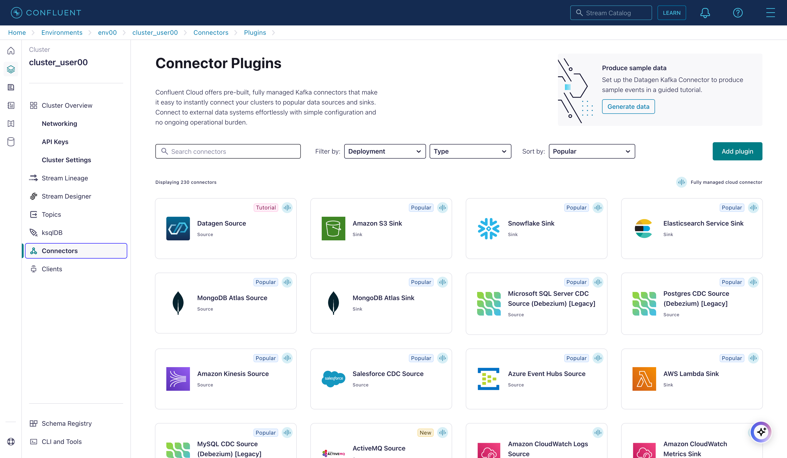

The Datagen Source Connector is a source connector which means, it'll produce data into a topic.
At this stage you can select the destination topic or create a new one.

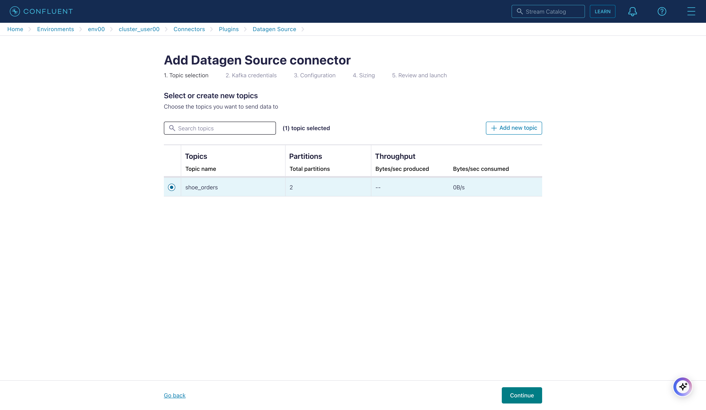

Confluent Cloud is a secured environment, in order to interact with the resources, you had to authenticate and have predefined authorization.
Despite being a technical component, the connector also needs to provide its identiy and permissions in order to produce data into a topic.

Confluent Cloud defines 2 kind of users:
* [User account](https://docs.confluent.io/cloud/current/access-management/identity/user-accounts/overview.html): Humans connecting to the Confluent Cloud UI
* [Service accounts](https://docs.confluent.io/cloud/current/access-management/identity/service-accounts/overview.html): technical components

In addition [Confluent Cloud proposes 2 kinds of API keys](https://docs.confluent.io/cloud/current/access-management/authenticate/api-keys/api-keys.html):
* Global API Keys(also called Cloud API Keys): They are linked to a user or service account and scoped to all the organization.
* Resource API Keys: They are linked to a user or service account and scoped to a given resource (ie. Kafka cluster, Schema Registry, etc.)

For the workshop, we'll use a Global Access which means the connector will be using your identity and associated permissions in this organization.

**Please note this is not a production-safe configuration. It's highly recommended to use service accounts and resource API Keys in real life.**

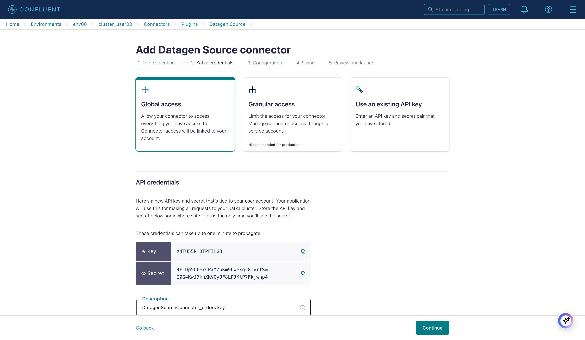

On the connector configuration, we'll use the `AVRO` format and the `Shoe order` quickstart.
The data formats (`AVRO`, `JSON`, etc.) will be discussed a bit further.

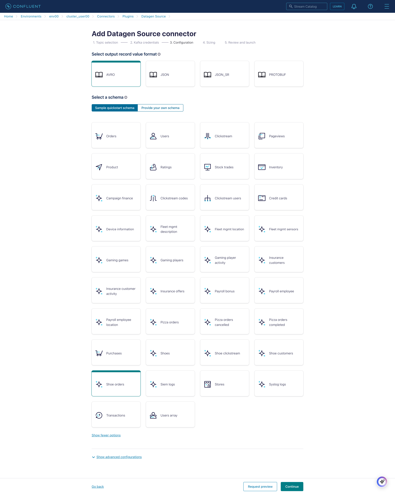

Depending on the performance objective, connectors might need to be scaled out. In this case, multiple instance of the connectors will run in parallel.
The price of the connector will depend on how much resources it requres.
For the moment, we don't need to scale the datagen connector.
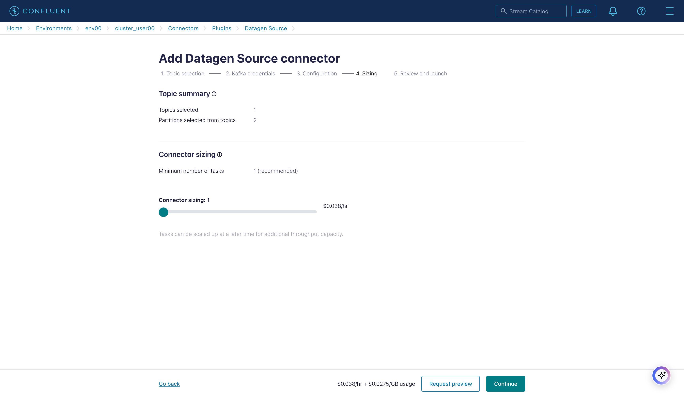

Finally you can give a name to your connector. We suggest `DatagenSourceConnector_orders`
Review its configuration and hit the `Continue` button.

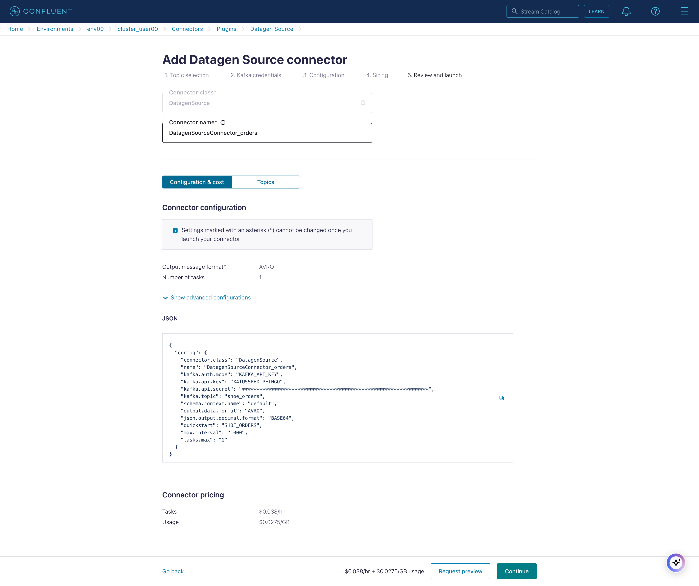

Your connector will spin up in a `provisioning` state first.


Once ready (and if the configuration is ok), you connector will be created and running.

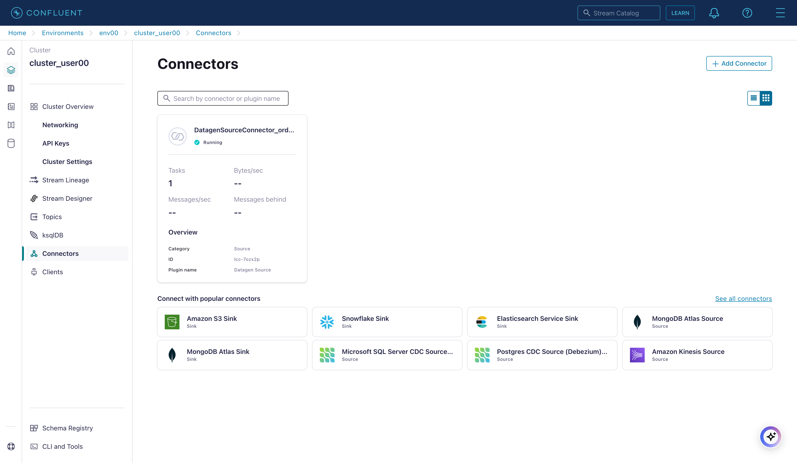

Finally!!! We have data produced, you can go back to the Topics UI and see the messages flowing


If you select one message, you can see its content.


## 5. Enforcing Data Governance through schemas

Kafka is purpose is to inter-connect applications. The classic data integration problem is to guarantee that the producer produces what the consumer expects and the other way around guarantee the consumer can read what the producer produce. And ideally this inter-operability should be future proof to survive to application evolution.

To solve this problem, Confluent provides a component called [Schema Registry](https://developer.confluent.io/courses/apache-kafka/schema-registry/).

Developers will now have to explicit the data format of their messages in a artefact called schema. Schema Registry job is to maintain a database of all of the schemas that have been written into topics in the cluster for which it is responsible. That “database” is persisted in an internal Kafka topic.

Schema Registry is also an API that allows producers and consumers to predict whether the message they are about to produce or consume is compatible with previous versions. When a producer is configured to use Schema Registry, it calls an API at the Schema Registry REST endpoint and presents the schema of the new message. If it is the same as the last message produced, then the produce may succeed. If it is different from the last message but matches the compatibility rules defined for the topic, the produce may still succeed. But if it is different in a way that violates the compatibility rules, the produce will fail in a way that the application code can detect.

Likewise on the consume side, if a consumer reads a message that has an incompatible schema from the version the consumer code expects, Schema Registry will tell it not to consume the message. Schema Registry doesn’t fully automate the problem of schema evolution—that is a challenge in any system regardless of the tooling—but it does make a difficult problem much easier by preventing runtime failures when possible.

Confluent permits to defines schema leveraging [3 data formats:](https://docs.confluent.io/platform/current/schema-registry/fundamentals/serdes-develop/index.html#serializer-and-formatter) [Avro](https://www.confluent.io/fr-fr/blog/avro-kafka-data) (the historical one), Protobuf and JSON Schema


Back to our `shoe_order` topic, we can see an Avro Schema has been created with the connector creation.

Schemas have:
* a type (Avro, Protobuf, JSON Schema)
* a version meaning the data structures might evolve and the topic migh contains messages with different versions of the same data structure
* an ID every schema is uniquely identified
* a compatibility meaning that depending on the strategy the client might automatically be able to read data produce in an older or newer format.

Data evolution is not magic and strict rules have to be applied to guarantee producer/consumer inter-operability despite application upgrades.


> **_QUESTION:_**  According to the [Schema evolution](https://docs.confluent.io/platform/current/schema-registry/fundamentals/schema-evolution.html) rules, what changes are allowed/forbidden to safely evolve a schema?

We have been looking at one schema for one topic. Let's now have a look to the Schema Registry.

In the Schema Registry you can see the list of subjects. A subject is the data structure the schema represents, for instance a Car, a Customer or a transaction. The schema is the actual definition of this subject (Subject+version = schema file).

By default the subject names follow the pattern `<topic-name>-(key|value)`. Here `shoe_orders-value` is the subject applied on the message's values of the topic `shoe_orders`.

> **_QUESTION:_**  According to the blog post [Putting Several Event Types in the Same Topic - Revisited](https://www.confluent.io/blog/multiple-event-types-in-the-same-kafka-topic/) would you recommend to have 1 or multiple subjects per topic?

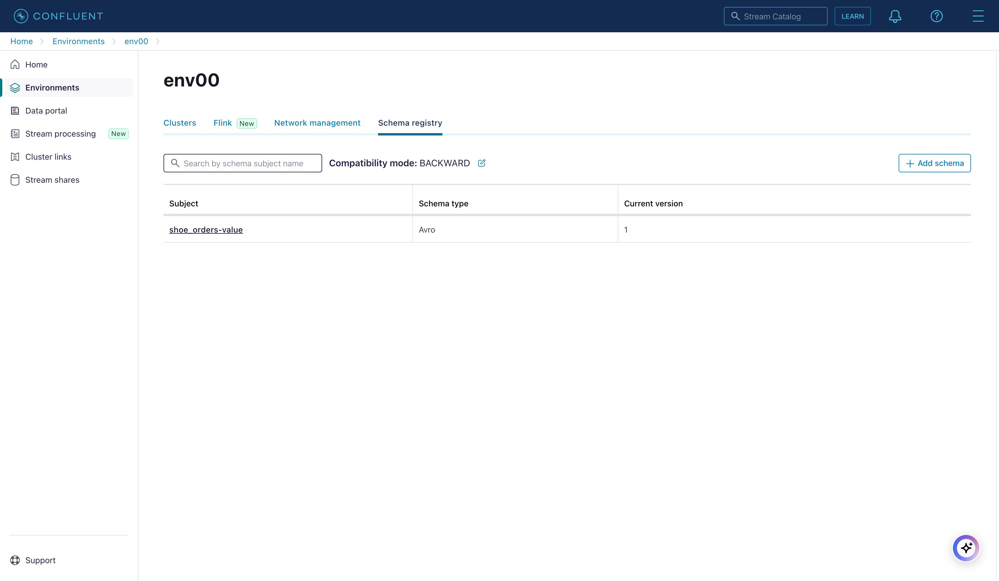

Clicking on the subject name you'll find the same details you had in the Topic's view.
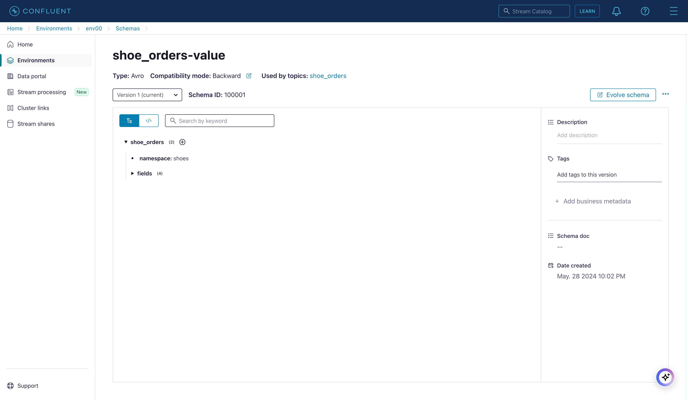

## 6. Getting starting with stream processing

Let's now have a bit of fun with the data.
The ecosystem of data processing tools is rich (Spark, Kafka Stream, etc.) but one is leading the game: Apache Flink.

Confluent Cloud provides a fully managed Flink service.
Just as clusters are managed at the environement level, Flink resources are as well.


Flink relies on a complex infrastrure abstracted in Confluent Cloud via the concept of Compute Pool.

A [compute pool](https://docs.confluent.io/cloud/current/flink/concepts/compute-pools.html#flink-sql-compute-pools) in Confluent Cloud for Apache Flink®️ represents a set of compute resources bound to a region that is used to run your SQL statements. The resources provided by a compute pool are shared between all statements that use it.

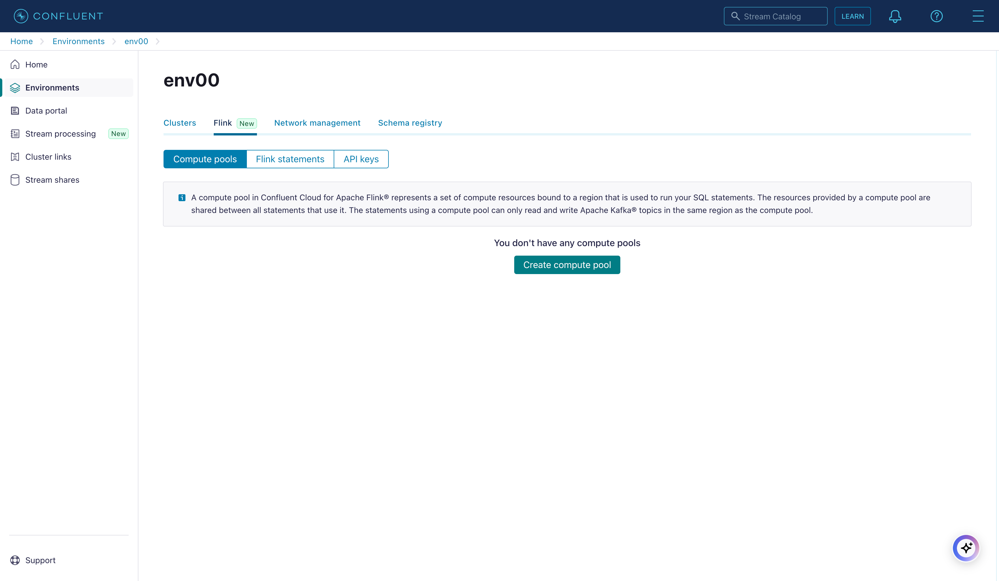

Just as a Cluster, a compute pool as to be created on a Cloud Provider Region.

For the workshop scope, it'll be in AWS eur-west-1
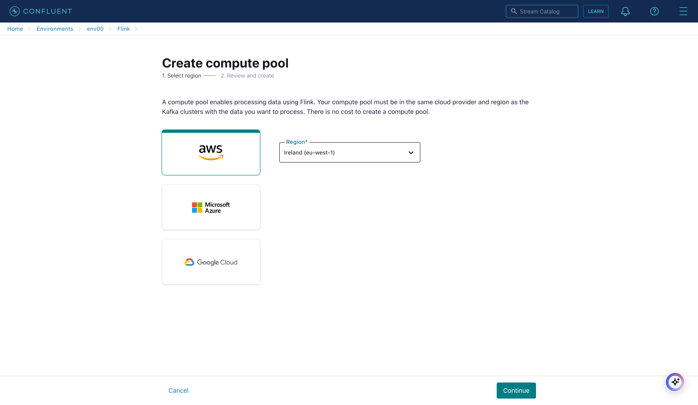

Give your compute pool a name and you're ready to go.

The billing is made per compute pool based on Confluent Flink Units (aka. CFU). The compute pool [scales automatically](https://docs.confluent.io/cloud/current/flink/concepts/autopilot.html) based on the Flink statements needs.


Once you're compute pool created, you can open the `SQL Workspace`
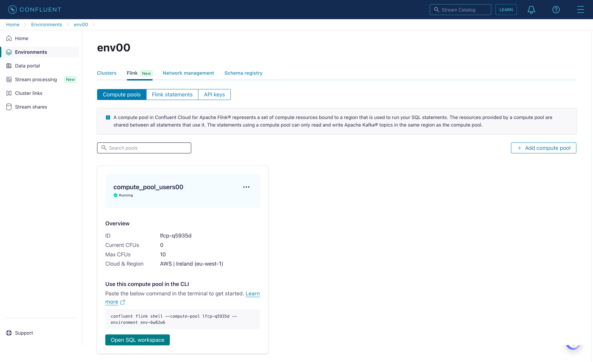

Flink is a processing technology providing 3 layers of API:
* Data Stream: the low level layer for super fine access to Flink concepts via Java or Python.
* Table API: intermediate layer for Java or Python which materialize all the Kafka topics as Tables (close to Kafka Stream DSL)
* [Flink SQL](https://docs.confluent.io/cloud/current/flink/reference/overview.html): High level API to express streaming processing pipeline via a SQL-like syntax

As of May 2024, Confluent Flink relies on [Flink SQL](https://docs.confluent.io/cloud/current/flink/reference/overview.html.

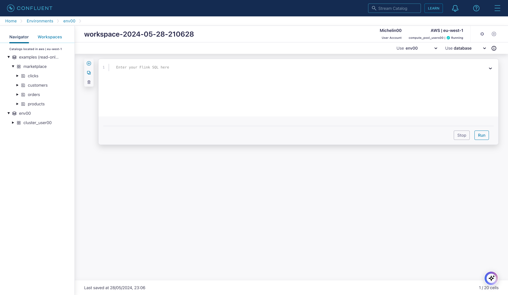

Since Kafka and Flink are at the core 2 different projects, they use different words to express commong concepts

Let's start with exploring our Flink tables.
Kafka topics and schemas are always in sync with our Flink cluster. Any topic created in Kafka is visible directly as a table in Flink, and any table created in Flink is visible as a topic in Kafka. 
Following mappings exist:

| Kafka          | Flink     | 
| ------------   |:---------:|
| Environment    | Catalog   | 
| Cluster        | Database  |
| Topic + Schema | Table     |


Check if you can see your catalog (=Environment)
```
SHOW CATALOGS;
```

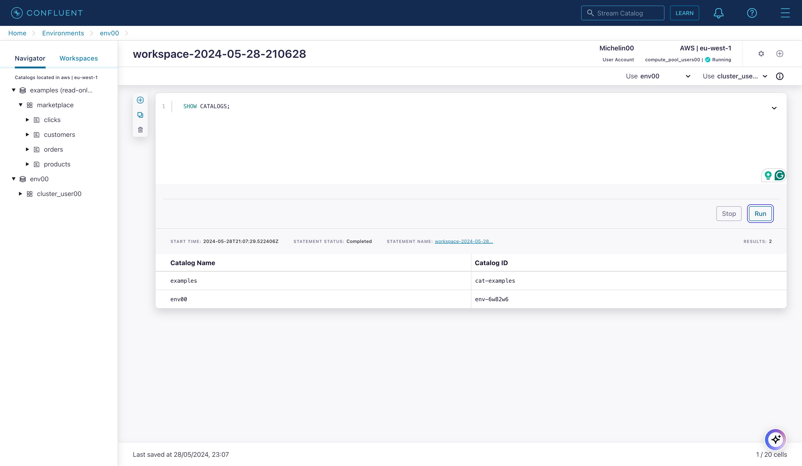

And databases (=Kafka Clusters):
```
SHOW DATABASES;
```


List all Flink Tables (=Kafka topics) in your Confluent Cloud cluster:
```
SHOW TABLES;
```
Do you see table `shoe_orders`?

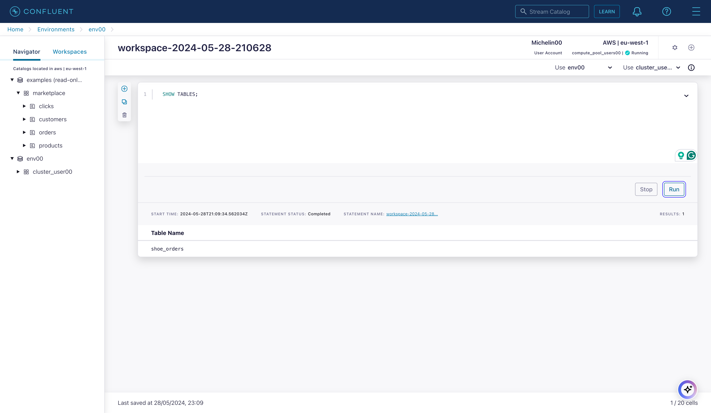

Understand how the table `shoe_orders` was created:
```
SHOW CREATE TABLE shoe_orders;
```

You can find more information about all parameters  [here.](https://docs.confluent.io/cloud/current/flink/reference/statements/create-table.html)

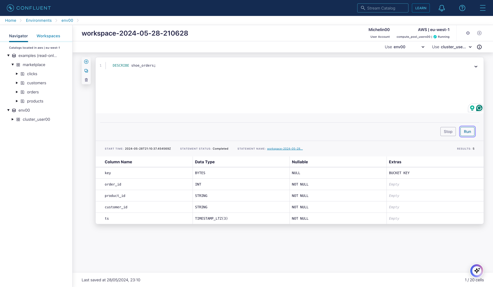

Our Flink table is populated by the Datagen connectors.

Let us first check the table schema for our `shoe_orders` catalog. This should be the same as the topic schema in Schema Registry.
```
DESCRIBE shoe_orders;
```
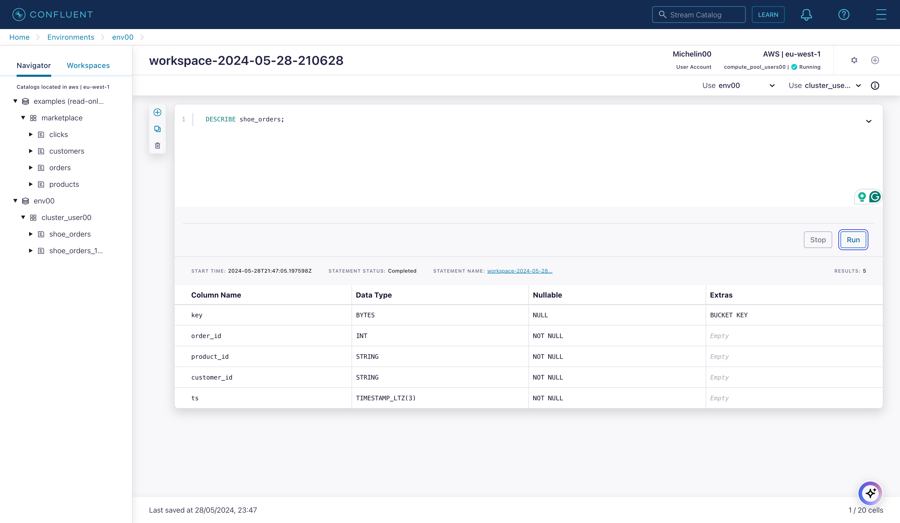

Let's check if any product records exist in the table.
```
SELECT * FROM shoe_orders;
```
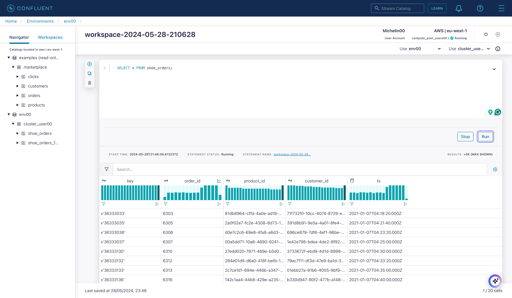

Are there any orders whose customer id starts with `d44` ?
```
SELECT * FROM shoe_orders WHERE customer_id LIKE 'd44%';
```
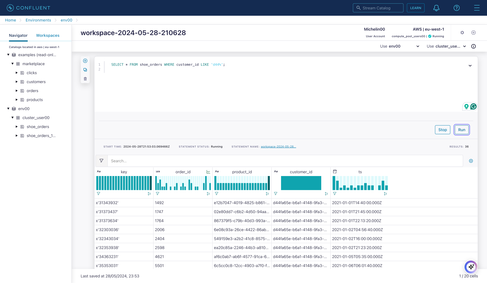

Let's now route all the orders having a customer ud starting with `d44` to a dedicated table.

We need to create a table that will have the same structure as `show_orders`. One lazy way of doing this is to ask Flink to get the `CREATE TABLE` statement

```
SHOW CREATE TABLE shoe_orders;
```

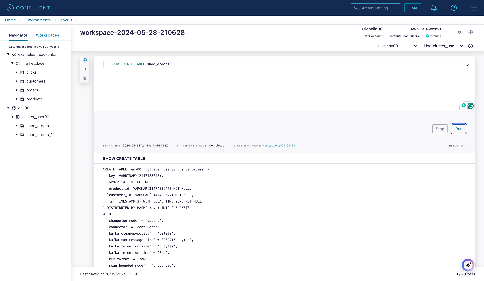

We can now shamelessly copy/paste the statement.
```
CREATE TABLE shoe_orders_d44 (
  `key` VARBINARY(2147483647),
  `order_id` INT NOT NULL,
  `product_id` VARCHAR(2147483647) NOT NULL,
  `customer_id` VARCHAR(2147483647) NOT NULL,
  `ts` TIMESTAMP(3) WITH LOCAL TIME ZONE NOT NULL
)
```


We can now insert in the new table the filtered data
```
INSERT INTO shoe_orders_d44
  SELECT * FROM shoe_orders WHERE customer_id LIKE 'd44%';
```


The query will run in the background (you can verify the `STATEMENT STATUS` is `Running`). You can stop the query by hitting the `Stop` button or leave the page.

You can verify the data by creating a new query.
```
SELECT * FROM shoe_orders_d44;
```

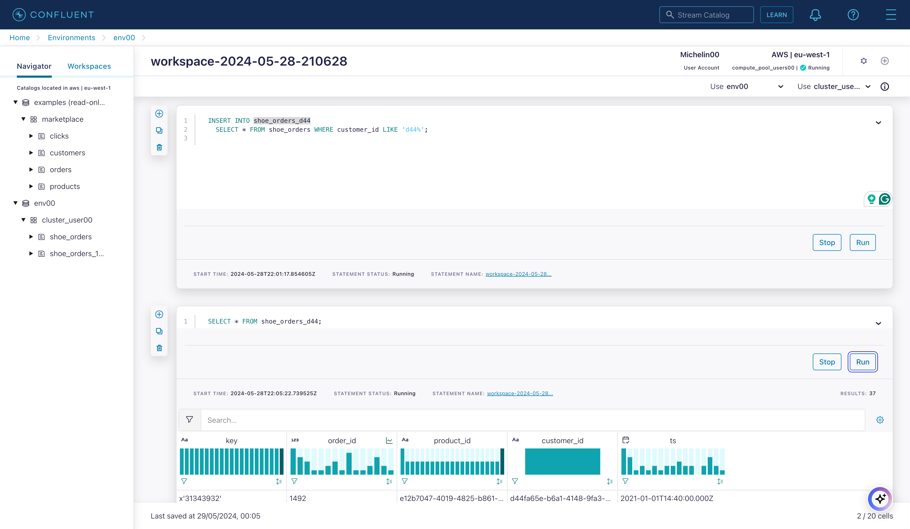

You can also open a new tab and go to the Topic's UI.


## 7. Data pipeline observability through Stream lineage

You have been producing data, processing it with Flink to generate new data.
At scale, observability on your data pipeline will be instrumental. This is exactly what the [Stream Lineage](https://docs.confluent.io/cloud/current/stream-governance/stream-lineage.html) feature permits to do.

Going back to the cluster view, you can hace access to the `Stream Lineage` view

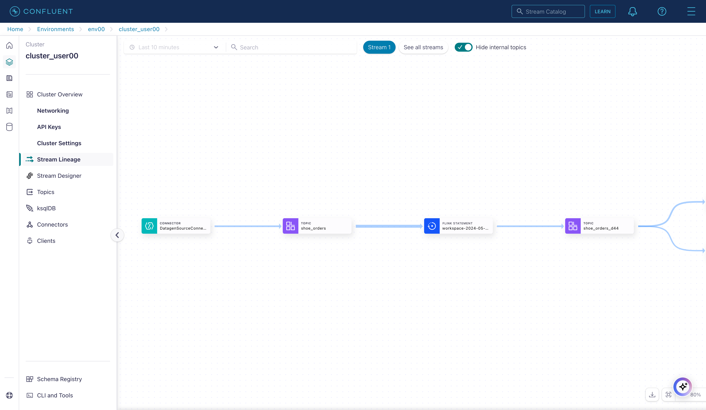

Clicking on one step of the pipeline will give you more details


## 8. Conclusion

What a long journey it has been!! Time to wrap up.
If you end up the lab you now have a clear understanding of:
* Confluent Cloud resources and structure
* Confluent Cloud Kafka clusters and topics
* Confluent Cloud Fully Managed Kafka Connectors
* Confluent Cloud Schema Registry and schema evolution
* Confluent Flink
* Confluent Cloud Stream Lineage

From there we suggesr you to attend the advanced Flink Workshop to continue exploring the Data Streaming Platform capabilities.